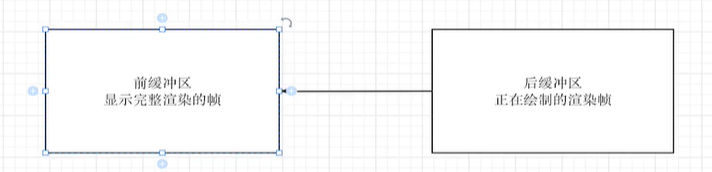

# 知识点概括

- React核心原理:一些react不会变化的核心内容
  - 声明周期
  - 虚拟DOM的实现
  - diff
  - 组件渲染和更新
  - hooks机制
- React事件和状态管理: 与用户交互相关的内容
  - 事件代理机制
  - 自定义事件系统
  - setState工作原理
  - 状态更新处理
  - props和state
- React架构:react18版本对核心原理的实现,也就是说核心原理是不变的,架构是在变化的
  - Fiber系统
  - Concurrent模式
  - Lane模型
  - 调度系统
  - 时间切片

# 导读

## 什么是react

A JavaScript library for building user interfaces

一个构建用户界面的js库,根据数据变化操作DOM的工具库

- 非mvc框架
- 为了灵活性没有使用template
- 响应式更新
- 不仅web,ios,server等

## react发展历史

- 0.3.0～0.14.0（2013.5.29 ～ 2015.10.7）
- React 15（2016.4.7）——基本功能、基本理念成熟
- React 16（2017.9.26）——Fiber架构的引入、16.8Hooks的引入
- React 17（2020.10.20）——事件委托机制变化，New Jsx Transform
- React 18（2022.3.29）——Concurrent、Suspense、Transitions

可以这样理解：

- 0.3.0～0.14.0 是基础功能的打磨过程
- React15，是一个基础实现版本的顶峰
- React16，核心就是架构变化，另外16.8引入了Hooks
- React17，局部优化、发展新特性
- React18，局部优化、发展新特性

# 原始版本

## 初始化项目

1. 创建项目`npx create-react-app 项目名称`
2. 删除无用文件

## JSX特点和编译

### 为什么不用模板

- 编写`jsx`可以充分利用`js`原语言描述抽象的能力,
- `js`可以直接控制`jsx`,由于`js`的灵活性,所以`jsx`表述页面也更加灵活,易重用,易扩展
- `react`内部以对`jsx`中特殊字符转义,可以防范`xss`攻击

### jsx的编译

`jsx `最终会被编译为`js`代码,经过`babel`编译后

- 17之前转换为`React.createElement()`,所以必须显示引入`React`
- 17之后转换为`jsxDEV`(生产模式为`jsx`),无需显示引入`React`

## react架构

- react与react DOM
  - react: 专注于组件相关的API暴露,可跨平台使用
  - react-dom: 与react包配合使用,专注于将组件渲染到某个平台: web,server
  - react-reconciler: 渲染相关的基础公共逻辑,也是可以跨平台使用,用于创建自定义的渲染器,可以认为react-dom就是使用react-reconciler创建的某个场景/平台下的渲染器

## React初始化渲染过程

1. 首先`jsx` 编译为`React.createElement(type,props,..children)`(`react17`之后转换为`jsx(type,props,...children)`)
2. `React.createElement`生成`vnode`
3. `ReactDOM.render()`渲染`vnode`
   1. 创建`DOM`
   2. 递归创建子元素,并添加至父元素
   3. 将`props`添加至`DOM`
   4. 将`DOM`添加至容器

```js
ReactDOM.render(
  <div>
    <span style={{ color: "red" }} className={"children"}>
      kkkk
    </span>
  </div>,
  document.querySelector("#root")
);

1.jsx转换为React.createElement
2.React.createElement生成vnode
3.ReactDOM.render渲染vnode
3.1.生成DOM
3.2.处理子元素
	3.2.1.string: 直接添加
    3.2.2:array: 循环递归
    3.2.3:单个vnode:递归
3.3.处理props
3.4.将DOM添加至页面
```

### React.createElement

- DISABLE_NEW_JSX_TRANSFORM=true禁用新的jsx转换方法

主要作用生成`vnode`,对比`vue`的`h`函数: `react.js`

```js
import { REACT_ELEMENT } from "./utils";

const createElement = (type, props, ...args) => {
  const ref = props.ref || null;
  const key = props.key || null;
  ["ref", "key", "__self", "__source"].forEach((key) => {
    delete props[key];
  }); // 删除无关属性

  if (args && args.length > 1) {
    props.children = args;
  } else {
    props.children = args[0];
  }
  props._owner = null;
  props._store = {};

  return {
    $$typeof: REACT_ELEMENT,
    type,
    key,
    ref,
    props,
  };
};

export default {
  createElement,
};
```

### ReactDOM.render

渲染`vnode`,对比`vue`的`render`函数,`react-dom.js`

```js
import { isArray, isObject, isString, REACT_ELEMENT } from "./utils";

/**
 * 初始化渲染
 */
function render(vnode, container) {
  // 挂载
  mount(vnode, container);
}

function mount(vnode, container) {
  const el = createDOM(vnode);
  container && container.append(el);
}

function createDOM(vnode) {
  const { type, props, $$typeof } = vnode;

  let el;
  if (type && $$typeof === REACT_ELEMENT) {
    el = document.createElement(type);
  }

  // 添加子元素
  if (props.children) {
    const children = props.children;
    if (typeof children === "string") {
      // 直接添加
      el.append(children);
    } else if (isArray(children)) {
      // 多个子元素处理
      mountArray(children, el);
    } else if (isObject(children) && children.$$typeof === REACT_ELEMENT) {
      mount(children, el);
    }
  }
  //处理属性
  setPropsForDOM(props, el);
  return el;
}

function setPropsForDOM(props, el) {
  if (!el) return;

  Object.keys(props).forEach((key) => {
    if (key === "children") return;
    if (/^on[A-Z].*/.test(key)) {
      // TODO: 事件
      return;
    }
    if (key === "style") {
      for (let styleKey in props[key]) {
        el.style[styleKey] = props[key][styleKey];
      }
    } else {
      // 其他属性暂时直接添加
      el[key] = props[key];
    }
  });
}

function mountArray(children, el) {
  children.forEach((child) => {
    if (isString(child)) {
      el.append(child);
    } else {
      const childDOM = createDOM(child);
      el.append(childDOM);
    }
  });
}

export default { render };
```

## 组件和react元素

### react元素

即jsx,一个静态的页面展示,通常作为组件的返回值

### 组件

一个小的,可重用的独立代码块,最终返回需要渲染到页面的`jsx`.必须大写字母开头

1. 具有状态
2. 具有数据变化自动更新视图的机制
3. 可重用

#### 函数组件

一个普通函数,只不过其返回的是一个`React Element`

#### 类组件

1. 继承自`React.Component`基类
2. 包含`render`函数,函数返回一个`React Element`

## React函数式组件实现

编写一个函数式组件

```js
function MyComponent(props){
  return <div>hello</div>
}
let a = <MyComponent />
```

在[`babel`编译平台](https://babeljs.io/repl#?browsers=&build=&builtIns=false&corejs=3.21&spec=false&loose=false&code_lz=Q&debug=false&forceAllTransforms=false&modules=false&shippedProposals=false&evaluate=false&fileSize=false&timeTravel=false&sourceType=module&lineWrap=true&presets=env%2Creact%2Cstage-2&prettier=false&targets=&version=7.25.1&externalPlugins=&assumptions=%7B%7D)中查看转义后的结果:


根据转义结果,可以知道,函数式组件最终编译为`React.createElement`,执行该函数会返回一个`type: MyComponent`的`vnode`,然后将这个vnode通过`ReactDOM.render`渲染,因此在`ReactDOM.render`中需要通过`type`是`function`类型的`vnode`获取其返回的成`vnode`,然后调用`createDOM`即可,在`react-dom.js`中

```js
function createDOM(vnode) {
    ...
  if (typeof type === "function" && $$typeof === REACT_ELEMENT) {
    // 函数式组件
    return getDOMByFunctionComponent(vnode);
  }
    ...
}

/**
 * 函数式组件渲染
 */
function getDOMByFunctionComponent(vnode) {
  const { type, props } = vnode;
  const funcRenderVnode = type(props);
  return createDOM(funcRenderVnode);
}
```

## React类组件实现

编译时类组件和函数式组件类似,都会编译成`React.createElement(组件名)`,因此实现类组件渲染时也类似:

1. 构建基类
2. 在`ReactDOM.render`函数中,单独处理类组件
3. 实例化组件,执行实例的render函数,获取vnode,然后调用createDOM即可

构建基类:`Component.js`

```js
export class Component {
  static IS_CLASS_COMPONENT = true;
  constructor(props) {
    this.props = props;
  }
}
```

添加处理函数式组件的方法:`react-dom.js`

```js
function createDOM(vnode) {
  const { type, props, $$typeof } = vnode;

  // 类/函数式组件
  if (typeof type === "function" && $$typeof === REACT_ELEMENT) {
    if (type.IS_CLASS_COMPONENT) {
      // 类组件
      return getDOMByClassComponent(vnode);
    }
    // 函数式组件
    return getDOMByFunctionComponent(vnode);
  }

  // 普通元素
  let el;
  if (type && $$typeof === REACT_ELEMENT) {
    el = document.createElement(type);
  }
    ....
}

/**
 * 类组件渲染
 */
function getDOMByClassComponent(vnode) {
  debugger;

  const { type, props } = vnode;
  const instance = new type(props);
  const classRenderVnode = instance.render();
  return createDOM(classRenderVnode);
}
```

## 类组件setState批处理

组件更新原理,执行`setState`,

1. 修改实例的`state`的值
2. 根据旧`vnode`获取到旧的`dom`,及其父元素
3. 然后执行`render`获取新的`vnode`,
4. 根据新的`vnode`生成新的`dom`
5. 删除旧`dom`,添加新`dom`至父元素

批处理机制:

- 由`updater`实例和`updaterQueue`接管每个组件的批处理逻辑
  - 每次`setState`时将值存在`updater`实例的队列`pendingStates`中
  - `isBatch === true`需要批处理,则将当前`updater`实例存储在全局队列中
  - 更新时,调用`updater`的更新方法,合并`pendingStates`所以值,并触发更新
- 在事件触发之后,开启批处理,缓存当前事件回调中所有的`setState`的值,

## React事件合成机制

什么是事件合成机制,为什么需要事件合成机制?

### 原生事件的问题

- 各个浏览器兼容性: 
  - 获取事件目标
  - 阻止冒泡
  - 取消默认行为
- 性能
  - 大量事件监听器,内存占用大,操作繁琐

### 解决目标

1. 使用事件委托,减少事件监听器的创建,
2. 实现自定义事件对象,统一事件对象的行为
3. 加入批处理

### 具体实现

#### 事件合成机制

- 事件委托
  - 根据`DOM事件流`的原理,将所有事件都委托到根元素,以减少事件监听器的创建和销毁.
    - 将事件保存在目标DOM元素上,建立事件和目标DOM的关系
    - 将所有事件都注册在根元素上,事件冒泡到根元素时,上述建立的关系,从目标DOM中获取事件回调函数并执行
- 自定义事件对象:浏览器行为差异主要在 阻止冒泡和阻止默认事件,这个两个行为都是通过事件对象进行的,为了抹平浏览器之间的差异,我们自定义一个事件对象代替原生的事件对象来接管这些行为,
  - 派发事件时,在自定义事件对象中添加兼容代码,
- 实现原生事件流机制: 由于使用了事件委托,所有的事件都相当于绑定在根元素上,自然就没有了原生的冒泡行为,所以需要手动实现事件冒泡和捕获
  - 通过循环,依次查找并触发父元素中绑定的对应事件
- 加入批处理机制,事件回调执行之前开启批处理,缓存事件回调执行时的所有`setState`,事件回调执行完毕后统一触发

#### 实现

`react-dom.js`中,添加处理合成事件的入口

```js
/**
 * 为dom添加属性
 */
function setPropsForDOM(props, el) {
....
    if (/^on[A-Z].*/.test(key)) {
      // TODO: 事件
+      addEvent(el, key.toLowerCase(), props[key]);
      return;
    }
    ...
}
```

`event.js`中实现合成机制的所有逻辑:

```js
import { updateQueue, flushUpdaterQueue } from "./Component";

export function addEvent(dom, eventName, eventFn) {
  // 建立DOM的联系,合成事件重点一,
  dom.attach = dom.attach || {};
  dom.attach[eventName] = eventFn;
  // 委托事件到根节点
  if (document[eventName]) return; // 已经委托过的就不需要重复委托了
  document[eventName] = dispatchEvent;
}

/**
 * 派发事件:
 * 批处理
 * 创建自定义对象抹平差异,
 * 触发该目标DOM上的事件,
 * 模拟原生捕获和冒泡
 */
function dispatchEvent(nativeEvent) {
  updateQueue.isBatch = true; // 开始批处理,暂存所有的setState
  // 创建自定义对象
  const syntheticEvent = createSyntheticEvent(nativeEvent);
  // 通过循环模拟原生冒泡行为,触发函数
  let target = nativeEvent.target;
  while (target) {
    syntheticEvent.currentTarget = target;
    const eventName = `on${nativeEvent.type}`;
    const eventFn = target.attach && target.attach[eventName];
    eventFn && eventFn(syntheticEvent);
    if (syntheticEvent.isPropagationStopped) {
      break; // 如果阻止了事件冒泡,则不需要继续执行
    }
    target = target.parentNode;
  }

  // 事件回调执行完毕,执行批处理
  flushUpdaterQueue();
}

/**
 * 创建自定义事件对象,抹平浏览器差异
 */
function createSyntheticEvent(naviteEvent) {
  const syntheticEvent = {};
  // 复制原生事件对象
  for (let key in naviteEvent) {
    syntheticEvent[key] =
      typeof naviteEvent[key] === "function"
        ? naviteEvent[key].bind(naviteEvent) // 如果是函数,复制时注意绑定this指向
        : naviteEvent[key];
  }
  // 添加兼容代码
  Object.assign(syntheticEvent, {
    naviteEvent,
    isDefaultPrevented: false,
    isPropagationStopped: false,
    // 统一阻止默认行为的方法
    preventDefault: function () {
      this.isDefaultPrevented = true;
      if (this.naviteEvent.preventDefault) {
        this.naviteEvent.preventDefault();
      } else {
        this.naviteEvent.returnValue = false;
      }
    },
    // 统一阻止事件冒泡的方法
    stopPropagation: function () {
      this.isPropagationStopped = true;
      if (this.naviteEvent.stopPagation) {
        this.naviteEvent.stopPagation();
      } else {
        this.naviteEvent.cancelBubble = true;
      }
    },
  });
  return syntheticEvent;
}
```

## ref原理

react中一个基本理念是数据驱动视图,但实际开发中某些场景无法符合这一理念,比如:

1. 点击按钮,让输入框聚焦

这种情况下,需要手动操作`DOM`实现,`ref`便是获取`DOM`的一种方式

### 原生标签和类组件

#### ref的行为

先看ref打印原生标签和类组件的例子

```js
class MyClassComponent extends React.Component {
  constructor() {
    super();
    this.elementRef = React.createRef();
    this.componentRef = React.createRef();
  }

  outPutRef() {
    console.log(this.elementRef);
    console.log(this.componentRef);
    this.componentRef.current.changeName();
  }

  render() {
    return (
      <div ref={this.elementRef}> // 原生标签的ref
        <div onClick={() => this.outPutRef()}>点击查看ref</div>
        <Component ref={this.componentRef} /> // 类组件的ref
      </div>
    );
  }
}
// 上述使用的类组件
class Component extends React.Component {
  constructor(props) {
    super(props);
    this.state = {
      name: "hhhh",
    };
  }
  changeName() {
    this.setState({ name: "oooo" });
  }

  render() {
    return <div>{this.state.name}</div>;
  }
}
```

触发`outPutRef`事件打印如下结果:

- 原生标签

  

- 类组件

  

#### ref原理

`React.createRef`返回的实际是一个包含`current`属性的对象,且初始值为`null`

对于原生标签,可以看到,current的属性值为标签对应的DOM元素,因此处理原生标签的ref时,需要将其**DOM对象赋值给current**

对于类组件来说,current的属性值为组件实例,因此再处理类组件的ref属性时,需要在组件实例化后,**将组件实例赋值给current**

#### 实现

创建ref

`react.js`

```js
function createRef() {
  return {
    current: null,
  };
}

export default {
    ...
  createRef,
};
```


`react-dom.js`

```js
// 原生标签处理ref
export function createDOM(vnode) {
+  const { type, props, $$typeof, ref } = vnode;
    ....
+  ref && (ref.current = el);
  return el;
}


// 类组件处理ref
function getDOMByClassComponent(vnode) {
+  const { type, props,ref } = vnode;
  const instance = new type(props);
+  ref && (ref.current = instance)
    ...
}
```

### forwardRef原理

#### 问题

类组件和原生标签都具有组件实例或`DOM`实例,因此可以将`ref.current`和实例关联起来,从而通过`ref`获取实例

但函数式组件没有实例,他返回多个标签,无法确需要将哪标签与`ref`关联

#### 解决方法

通过参数的形式将ref传递至子组件,在子组件中显式的将某个标签和`ref`关联起来,这也是`forwardRef`的实现原理

`forwardRef`允许组件使用`ref`将`DOM`暴露给子组件

使用方式:

```js
function Father() {
  const ref = React.createRef();
  const onClick = () => {
    console.log(ref);
    ref.current.innerHTML = "forwardRef";
  };
  return <Son ref={ref} click={onClick} />;
}

const Son = React.forwardRef((props, ref) => {
  return (
    <div ref={ref} onClick={props.click}>
      ref目标元素,点击修改内容
    </div>
  );
});

let a = <Son />;
console.log("a:", a);

ReactDOM.render(<Father />, document.getElementById("root"));
```

查看`变量a`的打印结果:


可以发现,被`forwardRef`处理过的组件,其实是一个对象,包含两个属性

- 类型: `$$typeof`
- `render`函数: `forwardRef`的参数

基于原理和forwardRef的具体表现,可以手动实现一下

#### 实现

`react.js`

```js
function forwardRef(render) {
  return {
    $$typeof: REACT_FORWARDREF,
    render,
  };
}

export default {
    ...
  forwardRef,
};
```

`react-dom.js`

```js
export function createDOM(vnode) {
  const { type, props, $$typeof, ref } = vnode;

  if (type && type.$$typeof === REACT_FORWARDREF) {
    console.log(vnode);
    return getDOMByForwardRefFunction(vnode);
  }
    ...
}

/**
 * forwardRef渲染
 */
function getDOMByForwardRefFunction(vnode) {
  const { type, ref, props } = vnode;
  const refRenderVnode = type.render(props, ref);
  if (!refRenderVnode) return null;
  return createDOM(refRenderVnode);
}
```

`utils.js`

```js
export const REACT_FORWARDREF = Symbol("react.forwardRef");
```

## diff

在更新组件时,通过`diff`算法来尽可能的减少真实`DOM`的创建和删除.

组件更新时机:状态变化时

需要深度`diff`的条件: `vnode`类型相同,且都有子元素,才需要对子元素进行深度diff

### diff parent

处理节点的更新

- `newVnode`不存在.`oldVnode`也不存在: 什么都不需要干
- `newVnode`存在,`oldVnode`不存在: 创建
- `newVnode`不存在,`oldVnode`存在: 删除
- `newVnode`存在,`oldVnode`存在: 需要替换,根据oldVnode类型进行处理
  - `oldVnode`为`reactElement`
    - 更新属性
    - 深度`diff`子节点 => `diff children`
  - `oldVnode`为`function component`
    - 重新执行,获取新的`vnode`
    - 然后`diff`
  - `oldVnode`为`class component`
    - 重新执行`render`,触发`update`方法,获取新的`vnode`
    - 然后`diff`
  - `oldVnode`为`text`
    - 更新`text`

### diff children

对子节点继续比较,尽量复用子节点

对于`newChildren`和`oldChildren`来说,遍历`newChildren`,有两大种情况需要处理,:

- 可复用: `newChildren`的子节点在`oldChildren`中存在,可复用时
  - 需要移动: `oldChildren.index < lastNotMoveIndex` (`oldChildren.index`代表的是在旧节点中的位置)
    - 使用`lastNotMoveIndex`记录上一个复用且未移动的节点的旧`index`,
    - 如果之后的可复用的`oldVnode`的`index`小于`lastNotMoveIndex`,说明需要移动,因为旧节点的`index`标识的是之前所有旧节点的排列顺序,而当前的遍历顺序是将来新节点的顺序,`index < lastNotMoveIndex`说明旧节点中`index`对应旧节点在`lastMoveIndex`对应旧节点之前,而目前根据遍历顺序新节点中`lastNotMoveIndex`对应复用的旧节点在`index`对应旧节点之前,因此需要移动`index`对应的旧节点
  - 不需要移动
    - 更新`lastNotMoveIndex`为未移动元素`oldChildren`的`index`
- 不可复用:`newChildren`的子节点在`oldChildren`中不存在
  - 创建节点

最后将旧节点中没有复用的节点删除即可

##### 具体步骤

1. 构建`oldVnodeAndOldVnodeMap`,
2. 遍历新节点:涉及 节点移动,节点删除,节点新增,节点不变,要把这些分类找出来,并将标记每个节点需要移动还是创建,最后将节点保存在`actions`
3. 删除需要移动和没有复用的旧DOM
4. 遍历actions,移动或创建节点

### 优化

在`diff children`中判断`oldChildren`是否需要移动是根据`lastNotMoveIndex`来的,并不能最少化移动子元素,比如

```js
this.old = ["1", "2", "3", "4", "5", "6"];
this.new = ["6", "2", "3", "4", "5", "1"];
```

上述算法会移动`"2", "3", "4", "5", "1"`五个元素,实际上只需要移动元素`"6","1"`就能达到效果.参考vue3最长递增子序列,确认最多哪些元素不需要移动

## 生命周期函数

- 什么是生命周期?

  某个对象的生老病死,放在react组件中就是指组件从创建到更新再到销毁的过程

- 什么是生命周期函数?

  在生命周期特定阶段执行的函数,**本质就是回调**

### 生命周期函数

即从组件创建到更新到卸载三个阶段的钩子函数

#### 创建阶段

执行先后顺序从上到下

1. `constructor`

   构造函数,实例化组件时触发

2. `static getDerivedStateFromProps`(不常用)

   - 参数:`newProps`,`newState`
   - 调用时机:每次渲染时`render`之前,返回一个对象,这个对象会作为新的`state`的值
   - 源码实现
   - 常见使用场景
     1. `state`需要随着`props`改变而改变

3. `render`

   render函数,实例化组件后触发

4. `componentDidMount`

   - 调用时机: `DOM`添加到页面上之后
   - 参数: newProps,newState
   - 常见的使用场景:
     1. 需要依赖真实`DOM`的操作
     2. 异步加载数据
     3. 事件订阅
     4. 不适合在这里`setState`,引起额外渲染

#### 更新阶段

1. `static getDerivedStateFromProps`

2. `shouldComponentUpdate`(不常用)

   - 参数: `newProps`,`newState`

   - 调用时机: 初次渲染或调用`forceUpdate`时不触发,数据更新时触发,用来标识`state`变化时,是否需要更新视图.如果返回`false`,表示不更新,返回true表示更新.默认为`true`.
   - 源码实现: 在实例的updater中实现

   - 常见使用场景:

3. `render`

4. `getSnapshotBeforeUpdate`(不常用):

   - 参数: `preProps,preState`
   - 调用时机: `render`执行之后,`dom`渲染之前,换句话说就是在state更新之后,dom更新之前执行,这样可以拿到state更新之后的状态
   - 可以用来获取state更新之前的dom的一些状态,返回给componentDidUpdate,从而做一些操作,比如聊天界面,新消息发送时保持一直滚动到底部

5. `componentDidUpdate`

   - 参数:`preProps`,`preState`,`snapshot`
   - 调用时机:组件状态更新重新渲染之后执行
   - 常见使用场景
     1. 初次挂载不会执行
     2. 状态改变时,需要操作`DOM`
     3. `props`变化时,适当的网络请求
     4. `setState`在这里使用需要加条件,否则会无限循环
     5. 如果实现了`getSnapshotBeforeUpdate`方法,第三个参数是该方法的返回值
     6. 如果实现了`shouldComponentUpdate`方法,且返回的未`false`,`componentDidUpdate`不会执行,render也不会重新执行

#### 卸载阶段

1. `componentWillUnmount`
   - 调用时机: 组件销毁之前调用
   - 常见使用场景:
     1. 做一些清理工作: 清除定时器,取消事件订阅

### fiber维度生命周期函数


## 性能优化

### pureComponent

自带`shouldComponentUpdate`的类组件,只有`props或者state`变化时才重新渲染.对新旧`props/state`做浅比较

实现原理:

`pureComponent`类继承`Component`基类,并实现`shouldComponentUpdate`函数,函数中通过浅比较的方式来判断`props`,`state`是否变化

### memo

`React.memo()`包装函数式组件,只要函数式组件props没有变化,则不会重新渲染函数式组件.

`React.memo`包装后返回的是一个对象,并不是一个虚拟DOM.

实现原理:

创建DOM时,根据类型判断如果式memo则单独渲染,在更新时如果`props`没有变化,停止更新即可

## Hooks

### Hooks存在的意义

解决类组件存在的弊端:

1. 逻辑难以重用
2. 更难以理解: 比如在一个生命周期函数中,可能书写多个不相关的逻辑,生命周期函数又没有意义,其意义在于在某个时机做某些事情,而这些事情,可能并不相关
3. 难以优化,有些优化无法在类组件无法实现

### Hooks的本质

就是一个普通函数,特别的地方在与,该函数提供了修改数据源方法,同时每次执行返回最新的数据源.

个人理解: `hooks`本质是闭包,通过`hooks`持有对数据源的引用,保证数据源不被`GC`机制销毁,不销毁,就可以用这个数据源来保持状态,从而之后可以操作数据源

### useState

为函数式组件提供状态

实现原理:

需要解决两个问题

1. 如何确保状态可以复用
   1. 设置一个全局变量states保存调用`useState`时声明的状态
2. 函数式组件中可能执行多次`useState`怎么确定`useState`顺序
   1. 闭包的形式保存当前`states`的`index`,每次`setState`时,通过保存的`index`找到对应的`state`进行修改

步骤:

1. 两个全局变量: `states`数组存放所有通过`useState`函数初始化的所有`state`,`stateIndex`标识当前存放`state`的位置.并通过闭包保存当前执行`useState`时的`stateIndex`
   1. 当执行某个`useState`返回的`setState`时,根据保存的`stateIndex`,设置`states`中对应下标的数据,并将这个数据返回
   2. 由于应用中`useState`的数量和顺序是固定的,当组件重新渲染之前,将`statesIndex`重置为`0`,放置重新执行每个`useState`时,没有获取原有的值,而是添加新值

```js
import { emitUpdateForFunctionComponent } from "./react-dom";

let states = [];
let hookIndex = 0;
export function useState(initialValue) {
  states[hookIndex] = states[hookIndex] || initialValue;
  let currentIndex = hookIndex;
  function setState(val) {
    states[currentIndex] = val;
    // 触发更新
    hookIndex = 0; // 触发钱hookIndex重置为0,因为更新函数式组件要重新执行函数,其中的执行过的useState还会再执行,再执行时需要根据hookIndex获取已经创建过的state,而不是重新生成新的
    emitUpdateForFunctionComponent();
  }
  return [states[hookIndex++], setState];
}
```

### useReducer

可以创建一个用户状态管理的`reducer`,可以将组件的所有状态放在`reducer`函数中进行管理

`useReducer`本质是,底层设置数据时,新数据是通过调用`reducer`函数得到的,

```js
const [state,dispatch]  =useReduce(reducer,{age:1})
...
const reducer = (state,action) => {
    switch (action.type){
        case 'add':
            return {age: state.age + 1}
            break
    }
    throw Error('Unknown action.',action.type);
}
```

参数

- `reducer`函数: 接收`state`和`action`,根据`action`的返回值设置新的`state`
- 初始值

实现原理:

和`useState`类似,只是初始化和修改内部的值的时候使用reducer的返回值

```js
export function useReducer(reducer, initialValue) {
  states[hookIndex] = states[hookIndex] || initialValue;
  let currentIndex = hookIndex;
  function dispatch(action) {
    states[currentIndex] = reducer(states[currentIndex], action);
    // 触发更新
    emitUpdateForFunctionComponent();
  }
  return [states[hookIndex++], dispatch];
}
```

### useEffect

类似类组件的`componentDidMount`和`componentDidUpdate`,当组件`DOM`挂载完毕和组件状态更新时调用.

如何做到在`DOM`挂载完毕才调用呢?

首先**要知道`DOM`的挂载,是一个微任务**,因此,只需要把`useEffect`中的函数包装成宏任务即可保证在`DOM`挂载完毕之后调用.

执行过程

1. 执行函数,因为useEffect是每次函数重新执行时执行的,所以每次`hookIndex`都会重置为`0`,而`useEffect`执行顺序都是固定的,因此不用担心多次执行相同的`useEffect`states中存储的`distoryFn和deps`不对应
   1. 执行`useEffect(effect,deps)`
   2. `states`中`hookIndex`索引处获取`distoryFn,deps`
   3. 如果`states[hookIndex]`没有值,则说明是初次挂载,如果deps中的任意值和之前不同,说明更新了,这两种情况都需要执行`effect`,
   4. 使用定时器将`effect`放进`宏任务队列`
2. 获取到函数返回的`vnode`,生成真实DOM,将挂载真实DOM的任务放进`微任务队列`
3. 同步任务执行完毕,检查并执行微任务队列: 将DOM挂载
4. 检擦并执行宏任务队列: `effect`执行

```js
export function useEffect(effect, deps) {
  debugger;
  const currentIndex = hookIndex;
  const [distoryFn, preDeps] = states[currentIndex] || [null, null];
  if (
    !states[currentIndex] ||
    deps.some((item, index) => item !== preDeps[index])
  ) {
    setTimeout(() => {
      distoryFn && distoryFn(); // 销毁函数
      // 放进宏任务队列,下次事件轮询执行,保证DOM渲染完毕
      states[currentIndex] = [effect(), deps];
    });
  }
  hookIndex++;
}
```

### useLayoutEffect

与`useEffect`高度相似,只是执行`effect`的时机不同,`useLayoutEffect`中`effect`被放在`微任务`队列,因此是在`真实DOM append`之前执行

执行过程:

1. 执行函数,因为useEffect是每次函数重新执行时执行的,所以每次`hookIndex`都会重置为`0`,而`useEffect`执行顺序都是固定的,因此不用担心多次执行相同的`useEffect`时`states`中存储的`distoryFn和deps`不对应
   1. 执行`useEffect(effect,deps)`
   2. `states`中`hookIndex`索引处获取`distoryFn,deps`
   3. 如果`states[hookIndex]`没有值,则说明是初次挂载,如果`deps`中的值和之前`deps`不同,说明更新了,这两种情况都需要执行`effect`,
   4. 使用定时器将`effect`放进`微任务队列`
2. 获取到函数返回的`vnode`,生成真实`DOM`,将挂载真实`DOM`的任务放进`微任务队列`
3. 同步任务执行完毕,检查并执行微任务队列:
   1. 第一个任务是`effect`,因此先执行
   2. 之后才会渲染

**queueMicrotask()**

`queueMicrotask()`添加任务到微任务队列,使`effect`在`DOM`渲染之前执行

```js
export function useLayoutEffect(effect, deps) {
  const currentIndex = hookIndex;
  const [distoryFn, preDeps] = states[currentIndex] || [null, null];
  if (
    !states[currentIndex] ||
    deps.some((item, index) => item !== preDeps[index])
  ) {
    queueMicrotask(() => {
      distoryFn && distoryFn(); // 销毁函数
      // 放进微任务队列,下次事件轮询执行,保证DOM渲染完毕
      states[currentIndex] = [effect(), deps];
    });
  }
  hookIndex++;
}
```

### useRef

与`React.createRef`不同的是,当重复执行的时候`useRef`不会重复赋值,因为优先使用缓存,所以不会重复赋值

```js
export function useRef(initialValue) {
  states[hookIndex] = states[hookIndex] || { current: initialValue };
  return states[hookIndex++];
}
```

### useImperativeHandle

通过ref暴露子组件的状态或方法给父组件

`useImperativeHandle(ref,fn)`

组件中如果提供了`useImperativeHanle`函数,那么该组件的`ref`会和`useImperativeHandle`的第二个参数返回值相关联

```js
export function useImperativeHandle(ref, dataFactory) {
  ref.current = dataFactory();
}
```

### useMemo&&useCallback

`useMemo(fn.deps):` 初始执行`fn`,返回执行结果,后续更新依赖数组中值不变,不会重新执行函数

`useCallback(fn,deps):`返回fn,后续更新依赖数组不变,`fn`不会重新创建

上述两个`API`常配合`React.memo`包装子组件,防止,父组件更新时,子组件做没必要的重新渲染.因为引用类型的值每次创建是不想等的,所以某些数据作为props时,即使数据没有变化,当父组件重新渲染也会造成props引用地址变化,导致子组件跟着渲染

```js
export function useMemo(fn, deps = []) {
  const [preValue, preDeps] = states[hookIndex] || [null, null];
  if (
    !states[hookIndex] ||
    deps.some((item, index) => item !== preDeps[index])
  ) {
    const newData = fn();
    states[hookIndex++] = [newData, deps];
    return newData;
  }
  hookIndex++;
  return preValue;
}

export function useCallback(fn, deps = []) {
  const [preFn, preDeps] = states[hookIndex] || [null, null];
  if (
    !states[hookIndex] ||
    deps.some((item, index) => item !== preDeps[index])
  ) {
    const newFn = fn;
    states[hookIndex++] = [newFn, deps];
    return newFn;
  }
  hookIndex++;
  return preFn;
}
```

# react18版本

## 新概念

### Fiber架构

`Fiber`架构是`react`为了解决性能问题和提升调度能力而引入的一种新的内部实现机制.它主要通过重新组织渲染过程,式React可以有效的执行渲染任务

**Fiber将一气呵成的渲染过程,拆分成可以独立运行的小任务,充分利用浏览器特性,依次提升性能**

`fiber`之前更新

- 基于堆栈的递归调和算法,更新阶段在进行虚拟`DOM`比较时可能会阻塞主线程.且无法中断.导致用户体验差

fiber之后更新

- 将大任务分解成小任务,放在时间切片中交替执行,防止长时间阻塞主线程

#### requestIdleCallback(callback)

`fiber`架构的原理类似该`API`,在浏览器空闲时执行某些任务,但`fiber`并没有使用这个`API`来实现

- `callback`参数: didTimeout,.....
- `fiber`没有使用的原因:
  - 兼容性
  - `callback`执行时机不可预测性

### fiber和fiber树

`fiber`是一种**数据结构**,放在代码中就是一个对象,该对象主要有以下属性:

```js
{
    type:组件类型
    key:组件的唯一标识,用于在组件树中区分兄弟节点
    props:组件的属性
    stateNode:对于类组件,这是组件实例.于原生DOM,这是实际的DOM节点.函数组件没有实例,所以为null
    return: 指向父fiber节点的指针
    child:指向第一个子fiber节点的指针
    sibling: 指向下一个兄弟fiber节点的指针
    flags:描述fiber节点需要执行副作用操作的类型:删除,更新和插入
    alternate:指向当前Fiber节点的替代Fiber节点,用于实现双缓存策略
}
```

fiber树是通过遍历虚拟`DOM`树生成的,将每个虚拟`DOM`节点转换成`fiber节点`,从而形成对应的树结构

`fiber架构`之前的渲染流程: `虚拟DOM树` => `真实DOM` => `挂载`

`fiber架构`之后的渲染流程: `虚拟DOM树` => `fiber树` => `真实DOM` => `挂载`

`fiber架构`之后真实`DOM`由`fiber树`生成,`虚拟DOM树`将不能直接转换成`真实DOM`,而是通过`fiber`作为桥梁进行转换

### 双缓冲策略

`react`中的双缓冲策略来源于于计算机图形渲染的概念:



**前缓冲区**:显示渲染完整的帧,用户能直接看到

**后缓冲区**:在内存中绘制下一帧,直到完整绘制好,交给前缓冲区显示.这里的内容由于在内存中进行,所以用户是无感知的

**解决的问题**:

防止某一帧绘制一半就显示了,导致用户感觉卡顿,用户体验较差

在`react`的`fiber架构`中也实现了类似的策略,由应用中总是存在两棵`RootFiber`树,分别对应前缓冲区和后缓冲区.


**当前渲染树:**第一个`RootFiber`: 可以理解为前缓冲区,该`根fiber节点`对应的`DOM`树就是用户正在看到的

**工作进程树**:第二个`RootFiber`:可以理解为后缓冲区,该`根fiber节点`是内存中正在计算的`fiber`树,

**提交阶段**:当工作进程树完成构建,React会在提交阶段将其应用到UI,这一步是依靠`alternate`属性实现的

**双缓冲区的作用:**实现高效更新,在新的fiber树上更改,同时保持旧的fiber树不变,一旦新的Fiber树准备好被提交,React就会在两颗树之间进行切换,从而实现高效更新

### 工作循环

`work loop`指`react`内部处理更新和渲染任务主要过程,前面我们知道`fiber架构`的特点是将整体渲染过程拆分为多个渲染小任务.这些小任务执行的过程就是`work loop`.主要分为两个阶段:

- 协调: 负责计算新的组件状态和虚拟`DOM`.确定需要的更新
  - 当组件发生更新时,React会触发协调过程,首先比较新旧虚拟DOM树之间的差异,以确定需要进行的更新.为了提高性能,React会将任务拆分为较小的执行单元,并在浏览器空闲时执行这些任务,这种调度策略避免长时间阻塞主线程,从而提高用户体验
- 提交:负责把计算出的新虚拟`DOM`应用到实际`DOM`上
  - 协调阶段结束,就触发提交阶段,这个阶段可能导致UI更新,所以React会在浏览器的一个连续帧中完成整个提交过程,避免页面卡顿

- 

### 并发模式

并发模式是一种机制,fiber将大任务分隔成小任务,并发模式可以实现任务优先级调度,涉及的概念有:

1. **并发**:js是单线程的,所以这里的并发是通过将任务分解成更小的部分在事件循环中交替执行,从而模拟并发的效果
2. **时间切片**:可以使react执行长时间更新任务时,保持用户界面的响应性,通过将任务分割后放在时间切片中执行,React在处理高优先级更新时暂停低优先级的任务,requestIdleCallback
3. **优先级调度**:将任务分级,根据任务优先级对任务进行调度.如高优先级任务: 用户交互响应,低优先级:数据请求
4. **有条件的渲染**:React18并发模式下,允许开发者在组件中显式声明某些更新具有较低优先级,如数据获取期间,可以使用startTransition使UI保持响应并显示加载,知道数据准备就绪

### fiber架构的作用

解决四个方面问题: 

1. 性能: fiber架构可以将整个任务分割成小任务,交替执行,减少主线程的长时间阻塞
2. 任务调度:便于实现并发模式,只有将整个任务分割成小的任务,才能对任务划分优先级,从而根据优先级调度任务
3. 可扩展性:fiber架构使得,react内部代码更加模块化,这方便了之后功能的扩展和维护
4. 错误处理: 引入完善的错误边界处理机制,允许开发者捕获和处理组件层级的错误

## 框架搭建

packages

- react:react中大部分API的暴露
- react-dom:渲染相关
- react-dom-bindings: 事件系统和对真实DOM的具体操作
- react-reconciler:fiber的所有内容,diff,
- scheduler:任务调度
- shared:工具函数

## 基础渲染能力

基础渲染能力包含三个步骤:

1. 第一步:jsx处理,将jsx代码编译为使用`jsxDEV`创建虚拟`DOM`的函数代码
2. 创建容器
3. render渲染

### jsxDEV

react18将创建虚拟DOM的方法由`React.createElement`转换成`jsxDEV`,所以18之后编写组件将不再需要显示的引入`React`,两个方法创建的虚拟DOM是相同的

```js
import { REACT_ELEMENT_TYPE } from "shared/ReactSymbol";

// config中不需要添加到props中的属性
const RESERVED_PROPS = {
  key: true,
  ref: true,
  __self: true,
  __source: true,
};
export function jsxDEV(type, config, maybekey) {
  let props = getProps(config);
  let key = getKey(config, maybekey);
  let ref = getRef(config);

  return createElement(type, props, ref, key);
}

function createElement(type, props, ref, key) {
  return {
    $$typeof: REACT_ELEMENT_TYPE,
    type,
    props,
    ref,
    key,
  };
}

function getProps(config) {
  let props = {};

  for (let propsName in config) {
    if (
      config.hasOwnProperty(propsName) &&
      !RESERVED_PROPS.hasOwnProperty(propsName)
    ) {
      props[propsName] = config[propsName];
    }
  }
  return props;
}
function getKey(config, maybekey) {
  let key = null;
  if (maybekey) {
    key = maybekey;
  }
  if (hasValidKey(config)) {
    key = String(config.key);
  }
  return key;
}
function getRef(config) {
  let ref = null;
  if (hasValidRef(config)) {
    ref = config.ref;
  }
  return ref;
}

function hasValidKey(config) {
  return config.key !== undefined;
}
function hasValidRef(config) {
  return config.ref !== undefined;
}
```

例子:

```js
const Son = <div style={{ color: "red" }}>健字号</div>;
console.log("Jsx:", Son);
```

上述代码最终被编译为调用`jsxDEV`的方式:

```js
import {jsxDEV} from "/node_modules/.vite/deps/react_jsx-dev-runtime.js?v=e992af48";
const Son = /* @__PURE__ */
jsxDEV("div", {
    style: {
        color: "red"
    },
    children: "健字号"
}, void 0, false, {
    fileName: "D:../react18-core/packages/index.jsx",
    lineNumber: 1,
    columnNumber: 13
}, this);
console.log("Jsx:", Son)
```

打印的结果为:

```js
{
    $$typeof:Symbol('react.element'),
    "type":"div",
    "props":{
        "style":{"color":"red"},
    	"children":"健字号"
     },
     "ref":null,
     "key":null
}
```

### createRoot

`createRoot`可以创建一个`react`容器,调用其`render`方法,可以将`虚拟DOM`进行渲染.

代码层面上,createRoot主要创建下图中`FiberRoot和第一个RootFiber`,并相互关联

```js
import {createRoot} from 'react-dom/client'
const root = createRoot(document.querySelector("#root"))
root.render(<Componet />)
```

与`ReactDOM.render`渲染效果相同,不同的地方在于:

1. **createRoot可以在并发模式下运行react应用(也可以非并发模式下使用),并发模式下渲染和更新利用时间切片是可以中断的**
2. **reactDOM.render是传统的渲染方式,渲染和更新是不可中断的**

`FiberRoot`: 整个应用程序的根节点,内部包含真实DOM,`current`属性指向`RootFiber`,属性的意思是;整个应用当前指向的Fiber树

`RootFiber`: `Fiber`树的顶层节点,`stateNode`属性指向`FiberRoot`

```js
Fiber节点结构:
{
    tag: 标签
    type:对应虚拟DOM的type
    key:对应虚拟DOM的key
    
    stateNode:对应该fiber节点的组件实例,或真实DOM,或null
    return:该fiber节点的父节点
    sibiling:该fiber节点的下一个兄弟节点
    child:该fiber节点的第一个子节点
    pendingProps:待生效的props
    memoizedProps:已经生效的props
    memoizedState:已经生效的状态
    updateQueue:存放所有等待更新的东西
    flags:与更新过程相关,标记对该节点应该做什么操作: 更新,删除,新增
    sutreeFlags:与更新过程有关,子节点的标记,当子节点没有需要操作的时候可以通过这个标记就知道不需要更新,跳过即可
    alternate:双缓存策略的实现关键,执行另一个rootFiber
    index:fiber节点在所在层的位置索引
}
```


1. react-dom/client/ReactDOMRoot.js:
   1. 创建createRoot函数
      1. createContianer创建root
      2. new  ReactDOMRoot使用构造函数创建一个对象,对象包含上述root和render方法,render方法中进行更新updateContainer
2. react-reconciler/src下创建上述createContainer,updateContainer,这两个方法都是fiber架构下的
   1. ReactFiberReconciler.js:
      1. createContainer方法: 通过createFiberRoot创建fiber根节点并返回
   2. ReactFiberRoot.js: 
      1. 实现createFiberRoot方法,
         1. 创建`FiberRoot`,通过`new FiberRootNode`创建一个对象,将真实`DOM`容器挂载到对象上,这个对象对应图中`FiberRoot`
         2. 创建`第一个RootFiber`,createHostRootFiber,对应图中`RiberRoot指向的RootFiber`
         3. 将`FiberRoot和RootFiber`相互关联: FiberRoot.current = RootFiber,表示应用当前所指向的fiber树,,RootFiber.stateNode = FiberRoot,表示该fiber树对应的真实DOM
         4. 初始化fiber节点的更新队列
   3. ReactFiber.js
      1. 实现createHostRootFiber:使用createFiber创建fiber节点
      2. 实现createFiber:通过new FiberNode构造函数创建fiber节点,如上述fiber结构所示
   4. ReactFiberClassUpdateQueue.js:创建更新队列
      1. initialUpdateQueue(fiber)
3. updateContainer:
   1. 获取FiberRoot,
   2. 创建更新对象,对象中添加要更新的虚拟DOM
   3. 将更新添加到当前RootFiber的更新队列,并返回RootFiber
   4. 在根Fiber中进行调度更新scheduleUpdateOnFiber(root)
      1. 包装更新任务通过时间分片进行执行(暂时先用requestIdleCallback来实现时间分片)
         1. `performConcurrentWorkOnRoot`:更新任务
            1. renderRootSync()暂时实现同步更新
               1. 创建渲染进程树perpareFreshStack
                  1. 如果没有渲染进程树,则创建一个新的fiber节点作为工作进程树的根节点
               2. workLoopSync
                  1. 
            2. finishedWork = root.current.alternate,获取finishedWork渲染好的工作进程树

### render

渲染过程阶段划分:

`fiber`架构下渲染过程为:`虚拟DOM` => `fiber树` => `真实DOM` => `挂载`,总体可以分为两个阶段:

1. 渲染阶段:对应函数:`beginWork`,`completeWork`
   1. `beginWork`:`虚拟DOM` => `fiber树`
   2. `completeWork`:``fiber树` => 真实`DOM`
2. 提交阶段: `commitWork`
   1. `真实DOM` => `挂载`

为什么要这样划分?

根据可中断和不可中断来划分任务,`虚拟DOM => fiber树`,`fiber树 => 真实DOM`这两个步骤可以根据`fiber`节点包含的丰富信息进行中断和恢复,而`真实DOM =>挂载`是不能中断的,这个步骤将和页面发生真实关系.所以`渲染阶段`可以中断恢复,`提交阶段`不可以

#### beinWork

根据虚拟DOM构建工作进程树

1. 根据workInProgress(当前处理的工作进程树的节点)的类型处理
   1. HostRoot
      1. 将更新队列中的属性合并到workInProgress的,memoziedState(将新vnode的属性合并到旧vnode)
      2. 根据虚拟DOM类型不同创建fiber
      3. 构建fiber节点之间的关系
   2. HostComponent
      1. 根据虚拟DOM的不同创建fiber
      2. 构建fiber节点之间的关系

最终构建的fiber树与DOM树对比:深色为生成真实DOM顺序,并不代表程序运行顺序


#### completeWork

由`fiber`节点生成真实DOM,需要注意的是:

1. 首次beginWork并不是构建了完整的fiber树,因为构建fiber时,只返回了第一个子节点,如果第一个子节点没有其他节点,那么下一次循环构建时,next为空,beginWork就停止了.然后进入completeWork,构建真实DOM,构建
2. 生成真实DOM的过程,会先生成子节点的真实DOM,然后才是自身,只有先生成子节点才能把子节点挂载到自身

上图执行顺序:

1. beginWork,构建fiber,A1 =>B1 => B2 =>C1 => C2 => C3
2. completeWork:构建真实DOM,C1 => C2 => C3时发现有子节点,以C3为父节点执行beginWork
   1. beginWork:构建fiber D1 => D2
   2. D1没有子节点,进行compeleWork,构建真实DOM D2 => D3(D3也没有子节点)
3. 继续构建真实DOM: C3 => B1 => B2 => A

**beginWork与completeWork相互配合关系**:

1. beginWork先构建fiber树,直到第一个子节点(last)没有子节点
2. completeWork对last进行构建真实DOM,
3. 真实DOM构建完毕,获取last的sibing兄弟节点,开始处理兄弟节点
   1. 如果没有兄弟节点:表示该层节点已经全部转换为真实DOM,可以处理父节点了
   2. 如果有兄弟节点:以兄弟节点为父节点进行beginWork,开始构建兄弟节点的子节点的fiber,参考第一步

总共做了三件事:

2. 根据fiber创建真实DOM,使用stateNode将fiber与之关联
2. 添加子DOM
2. 处理真实DOM的属性,文本节点就是在这里被添加的
2. 冒泡收集flags和subtreeFlags,到当前workInProgress的subtreeFlags

#### commitWork

1. 递归处理子节点
2. 获取父节点
3. 获取锚点
4. 添加到父元素

DOM树到fiber树 => 真实DOM树转换过程


## React合成事件系统

事件注册和事件派发两大步骤

目的:

1. 抹平浏览器之间的差异
2. 优化性能: 使用事件委托: 所有事件只注册一次,注册在根节点,避免存在过多事件监听器,减少添加和移除事件监听器的操作

### 事件名注册

将`react`事件名,存放在`allNativeEvents`集合中.

应用初始化时自动存放

### 事件注册

1. 遍历`allNativeEvents`为`根容器`添加所有事件的监听器
   1. 通过事件包装函数创建`listener`
      1. `dispatchEvent`创建`listener`
   2. 根据`listener`为`根容器`添加捕获阶段和冒泡阶段的监听器

### 事件派发

`dispatchEvent`

1. 根据原生事件对象获取`DOM`
2. 根据`DOM`获取对应`fiber`对象
   1. 在创建`element`时,关联`fiber`和`element`
3. 根据`fiber`收集事件函数

### 合成事件对象

创建合成事件对象,抹平浏览器之间的差异,

1. 阻止默认事件
2. 阻止事件冒泡

### 处理分发队列

1. 将`dispatchQueue`中的`listeners`遍历执行
   1. 正序遍历:模拟冒泡
   2. 倒序遍历:默认捕获

## DOM DIFF

fiber架构与老版本的比较:

1. 渲染过程
   1. 老版本: 虚拟DOM => 真实DOM => 挂载
   2. fiber:虚拟DOM => fiber节点 => 真实DOM => 挂载
2. 更新过程
   1. 老版本: 新旧虚拟DOM对比 => 复用/删除/新增 => 新虚拟DOM => 真实DOM => 挂载
   2. fiber架构: 新虚拟DOM与老fiber节点对比 => 复用/删除/新增fiber => 新fiber树 => 真实DOM => 挂载

### diff时两种场景和diff方式

可以复用的判断条件: key与type都相同

#### 单节点场景

新的虚拟DOM为单个节点

1. 是否有老fiber,没有则直接创建
2. 有:比较key
   1. 不同
      1. 删除当前fiber,
      2. 没有兄弟节点:删除其余节点
      3. 比较兄弟fiber,回到第一步
   2. 相同
      1. 比较type
         1. 相同:可以复用,根据oldFiber复制出新的fiber并更新属性,删除剩余的fiber
         2. 不同:不可以复用,删除当前及其兄弟fiber

#### 多节点场景

新虚拟DOM是数组,采用三个方案进行比较,依次尝试各个方案

1. 先同序比较key,如果key不同则终止比较
   1. 如果key相同,则比较type
      1. type相同可以直接复用
      2. type不同,需要根据vnode创建新的fiber
      3. 记录复用节点的最大index,对fiber添加标记
      4. 然后同步比较下一个fiber和vnode
2. 判断老fiber节点是否还有,如果没有,则将剩下的新vnode全部创建为新fiber
   1. fiber节点没有了,则将剩下的vnode一一创建
3. 执行到此时,说明老fiber节点还有没比较的节点,新vnode也还有没比较的节点,
   1. 构建老fiber与key的映射,方便新虚拟DOM生成fiber是查找是否能够复用
   2. 能复用就复用,不能复用就创建
   3. 记录复用节点的最大index,对fiber添加标记,是移动还是不动

最终形成的fiber树中,节点就有了各种标记

## Hooks

### Hooks整体实现结构

1. 每个hook都有对应的三个阶段`挂载和更新,触发`,第一执行时执行挂载逻辑,后续执行时执行更新逻辑,执行设置hook的值,或者执行副作用时为触发阶段
2. `renderWithHooks`根据是否为初次执行,使用不同的函数进行处理:
3. 内部有一个dispatcher对象,该对象挂载了各种hook,
4. 这些逻辑在`renderWithHooks`内执行完毕
5. 最终会有两个链表一个队列: 
   1. `hook`对象的链表,挂载在`fiber`的`memoizedState`中,保证函数式组件更新时,每个hook更新前后对应
   2. `update`对象的环形链表,挂载到`hook`对象的`queue.pending`上
   3. `concurrentQueue`队列:每三个一组存放`fiber,queue,update`,保证多次执行多个不同hook时,在之后构建update链表时,`update`和`fiber`,`queue`能对应到相同的`hook`:如第一个更新是`setB()`,第二个更新是`setA()`,第三个更新又是`setB`,
6. 会使得全局变量`currentlyRenderingFiber`的`memoizedState`属性变化

变量解释:

1. `currentlyRenderingFiber`:当前处理的函数式组件对应的fiber

2. `memoizedState`: `fiber`的属性,指向`hooks`链表的头节点

3. `updateQueue`: `fiber`的属性,待更新队列

4. hook对象结构

   ```js
   {
       memoziedState:hook的值,
       queue:{
           pending:update环形链表
       },
       next:指向下一个hook对象
   }
   ```

   


### useReducer

`hook`第一次执行时进行`mount`,后续重复执行时,执行`updateReducer`.

#### useReducer执行整体流程:

**重要的全局变量:**

1. `currentlyRenderingFiber`:当前正在处理的函数式组件对应`fiber`,最终将函数式组件中使用的`hook`一链表形式挂载到`fiber`的`memoizedState`中
2. `workInProgressHook`: 当前正在执行的`hook`,为了方便挂载时创建链表
3. `currentHook`:当前正在执行的`hook`,为了方便更新时创建链表

**挂载阶段:**

1. `mountedReducer`挂载`hook`,函数式组件第一次执行时,
   1. `mountWorkInProgress`创建`hook`链表挂载到函数式组件的fiber上,每执行一个`hook`往链表上添加一个`hook`节点
   2. 返回`[hook.state,dispatchAction]`

**更新阶段**

执行action时:

1. `updateReducer`更新hook,函数式组件后续执行时: 
   1. `updateWorkInProgressHook`根据老链表创建新链表,复用老链表的,`state`和`queue`
   2. 关联`hook`链表到`fiber`
   3. 重新执行`hook`获取新值,赋值`hook`对象新的值

**触发阶段,dispatchAction派发更新逻辑:**

如`setState`等函数触发时:

1. 创建一个`update`对象,存放更新的内容
2. 将`fiber,queue,update`入队
3. `scheduleUpdateOnFiber(root)`调度开始更新
4. 在进入工作循环之前`finishQueueingConcurrentUpdates`,此时当前`fiber`节点的`hook`该入队的已经入队了
   1. 保存更新队列的`index`,每三个一组取出`fiber,queue,update`
   2. 构建`update`循环链表,并使`queue.pending`指向环形链表的最后一个`update`节点

### useState

借用`userReducer`实现

**挂载阶段,mountUseState**:

1. 创建`hook`对象,添加至`hook`链表
2. 返回`[hook.memoizedState,hook.queue.dispatch]`

**更新阶段,updateUseState**:

1. 调用`updateReducer`,
   1. 在新的`fiber`上通过`updateWorkInProgress`构建新的`hook`链表,并复用旧的状态
   2. 判断是否`queue`中有更新
   3. 执行更新
   4. 返回新的值`[state,dispatch]`

**触发阶段:dispatchStateAction派发更新逻辑**:

1. 创建更新对象`update`,
2. 计算新值,并于旧值通过`Object.is`比较,没有变化终止更新
3. `fiber,queue,update`入队
4. `scheduleUpdateOnFiber(root)`调度开始更新
5. 在进入工作循环之前`finishQueueingConcurrentUpdates`,此时当前`fiber`节点的`hook`该入队的已经入队了
   1. 保存更新队列的`index`,每三个一组取出`fiber,queue,update`
   2. 构建`update`循环链表,并使`queue.pending`指向环形链表的最后一个`update`节点

### useEffect

**挂载阶段:**

构建hook链表

在fiber的updateQueue中构建effect链表

**更新阶段**:

构建hook链表

重新构建fiber的updateQueue中构建effect链表

**触发阶段:**

在commit阶段,自动执行

## lane模型和优先级

在应用中,用户点击按钮之后的更新是任务,发送网络请求是任务,渲染DOM也是任务.这些任务最终都要在渲染主线程执行,由于js是单线程的,当任务并发发生时,后续任务需要等待当前任务执行完毕才能执行,从而造成阻塞.

一般的任务比如发送网络请求获取数据,即使被阻塞,对用户的体验影响并不大,但有些需要立即给用户反馈的任务如按钮点击事件.如果被阻塞则非常影响用户体验.因此最好能对任务进行优先级划分,当产生优先级较高的任务时,优先执行

在`react`中通过`lane`模型表示各个任务的优先级,在`lane`模型中,通过不同的二进制数字标记任务不同的优先级:

- `react18`中,数字越小优先级越高

### 二进制的计算

`javaScript`中使用`64`位表示数字,在进行二进制计算时,会处理位`31`位二进制数字进行计算

#### 与

真值表,有0为0,全1为1

| 按位与    |
| --------- |
| 0 & 0 = 0 |
| 0 & 1 = 0 |
| 1 & 0 = 0 |
| 1 & 1 = 1 |

#### 或

真值表,有1为1,全0为0

| 按位或     |
| ---------- |
| 0 \| 0 = 0 |
| 0 \| 1 = 1 |
| 1 \| 0 = 1 |
| 1 \| 1 = 1 |

#### 异或

相同为1,不同为0

| 按位异或  |
| --------- |
| 0 ^ 0 = 1 |
| 0 ^ 1 = 0 |
| 1 ^ 0 = 0 |
| 1 ^ 1 = 1 |

#### 取反

1为0,0为1

| 按位取反 |
| -------- |
| ~1 = 0   |
| ~0 = 1   |

#### 左移

将所有二进制数整体向左边移动n位,空出的位置补0

每左移一位相当于将数字乘以2,超出位数的高位会被丢弃

| 左移一位        |
| --------------- |
| 001 << 1 =  010 |

#### 右移

将所有二进制数整体向右移动n位,空出的位置,根据符号位补0或补1,符号位是0则补0,符号位为1则补1

每右移1位相当于将数字除以2并取整数

| 右移一位       |
| -------------- |
| 010 >> 1 = 001 |

#### 无符号右移

与右移相似,区别在于无符号右移高位补`0`

```js
010 >>> 001
```

#### 计算负值

正值按位取反+1即为对应的负值

### 最小堆算法


**什么是最小堆**

最小堆是一颗具有有序性的特殊的完全二叉树

1. 特殊的完全二叉树: 在二叉树中除了最底层之外的所有层均被填满.最底层的节点从左到右填充.
2. 有序性:任何节点的值都小于,等于其子节点的值

由有序性可知: 在最小堆中,根节点是所有节点的最小值.也就是说从上到下节点的值依次变大.该种数据结构适合**快速访问和删除最小元素的场景**

react中以数组的形式记录最小堆的所有节点,由于是完全二叉树,那么子节点和其父节点`索引`的关系为:

```js
leftChildIndex = 2 * parentIndex + 1
rightChildIndex = 2 * parentIndex + 2 
// 只要知道子节点索引或父节点索引,便能推出它的父节点或子节点
```

最小堆可以降低查找的时间复杂度:

- 直接在数组中查找某个值的时间复杂度: `O(n)`
- 在最小堆数组中查找某个值的时间复杂度: `O(log n)`

**react中如何应用最小堆**

1. `react`中使用`lane`模型来标记任务优先级,值越小,优先级越高,
2. 最小堆根节点是所有节点的最小值,且最小堆中查找算法时间复杂度为`O(log n)`

由上面两点可以联想到,`react`中利用最小堆算法,每次执行任务时,查找到优先级最高的任务,然后执行

1. push: 把任务存放在一个数组中,并按照最小堆的索引,调整数组元素顺序
2. peep: 取出数组中优先级最高的任务,即最小堆的根节点
3. pop:取出数组中优先级最高的任务,同时删除改元素

### react中的优先级体系

`react`中优先级有任务优先级,调度优先级,事件优先级,和lane优先级他们的依赖关系如下

任务优先级 => 事件优先级 => 调度优先级

- 任务优先级:由任务对象的超时时间或id表示.
- 事件优先级:包括,点击事件,输入事件,鼠标移入事件,等等,某个范围内的任务优先级会被划分为某个事件的优先级
- 调度优先级: 决定任务优先级在任务优先级中的`超时时间`由不同的调度优先级,设置不同的值
- lane优先级: 这里的lane表示的是fiber对象上关联的任务的优先级,与事件优先级对应,比如某个范围内的二进制所表示的优先级任务为点击事件的优先级.

## 调度系统

### 调度优先级的实现

任务指得就是每次调度更新的那个函数

1. 通过MessageChannel,定义两个端口进行通信,
2. 创建任务对象,根据任务的优先级,设置任务对象的过期时间
3. 将任务加入堆
4. prot2端口调度port1端口,在时间分片内轮询执行任务

### lane优先级映射表

由`lane`优先级确定事件优先级,由`31`位二进制数字组成,每个位置代表一个车道

```js
export const TotalLanes = 31;
/** 无车道 */
export const NoLanes = 0b0000000000000000000000000000000;
/** 无车道 */
export const NoLane = 0b0000000000000000000000000000000;
/** 同步车道 */
export const SyncLane = 0b0000000000000000000000000000001;
/** 输入连续水合车道 */
export const InputContinuousHydrationLane = 0b0000000000000000000000000000010;
/** 输入连续车道 */
export const InputContinuousLane = 0b0000000000000000000000000000100;
/** 默认水合车道 */
export const DefaultHydrationLane = 0b0000000000000000000000000001000;
/** 默认车道 */
export const DefaultLane = 0b0000000000000000000000000010000;
/** 选择性水合车道 */
export const SelectiveHydrationLane = 0b0001000000000000000000000000000;
/** 空闲水合车道 */
export const IdleHydrationLane = 0b0010000000000000000000000000000;
/** 空闲车道 */
export const IdleLane = 0b0100000000000000000000000000000;
/** 屏幕外车道 */
export const OffscreenLane = 0b1000000000000000000000000000000;
/** 非空闲车道 */
const NonIdleLanes = 0b0001111111111111111111111111111;
```

### 事件优先级映射表

1. 离散事件优先级:一瞬间瞬间那种事件,如点击
2. 连续事件: 如鼠标拖动事件,

```js
// 事件优先级映射表,
import {
  NoLane,
  SyncLane,
  InputContinuousLane,
  DefaultLane,
  IdleLane,
  getHighestPriorityLane,
  includesNonIdleWork,
} from "./ReactFiberLane";

/** 离散事件优先级，与SyncLane相关联,指一瞬间一瞬间的事件,如点击事件 */
export const DiscreteEventPriority = SyncLane;
/** 连续事件优先级，与InputContinuousLane相关联,指连续发生的事件,如鼠标拖拽事件 */
export const ContinuousEventPriority = InputContinuousLane;
/** 默认事件优先级，与DefaultLane相关联 */
export const DefaultEventPriority = DefaultLane;
/** 空闲事件优先级，与IdleLane相关联 */
export const IdleEventPriority = IdleLane;

/**
 * @message: lane优先级转换为事件优先级
 */
export function lanesToEventPriority(lanes) {
  let lane = getHighestPriorityLane(lanes);
  // 如果车道优先级大于离散事件优先级,则返回离散事件优先级
  if (isHigherEventPriority(lane, DiscreteEventPriority)) {
    return DiscreteEventPriority;
  }

  // 如果车道优先级大于连续事件优先级,则返回连续事件优先级
  if (isHigherEventPriority(lane, ContinuousEventPriority)) {
    return ContinuousEventPriority;
  }

  // 如果车道中包含空闲车道优先级,则返回默认事件优先级
  if (includesNonIdleWork(lane)) {
    return DefaultEventPriority;
  }
  // 都不是返回空闲事件优先级
  return IdleEventPriority;
}
```

### 调度优先级映射表

```js
// 调度优先级映射表

// 无优先级
export const NoPriority = 0;
// 立刻执行优先级
export const ImmediatePriority = 1;
// 用户阻塞操作优先级，例如用户点击、用户输入
export const UserBlockingPriority = 2;
// 正常优先级
export const NormalPriority = 3;
// 低优先级
export const LowPriority = 4;
// 空闲优先级
export const IdlePriority = 5;
```


> https://www.yangyitao.com/react18/ 
